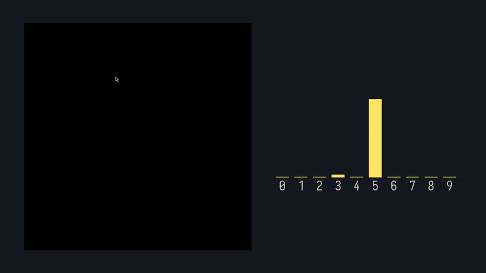

# digit-neural-net 🧠

A **CPU-only implementation** of a fully connected feed-forward neural network for handwritten digit classification (e.g., MNIST).  
Implements **backpropagation**, supports **mini-batch training**, and uses the **Adam optimizer**.



---

## 🚀 Features
- Feed-forward architecture  
- Backpropagation with Adam optimizer  
- Mini-batch training  
- Input: 28×28 pixel grid  
- CPU-only — no external deep learning frameworks  
- Lightweight and educational C++ implementation  

---

## 🧩 Architecture (to be generalized)
- **Input layer:** 784 neurons  
- **Hidden layers:** configurable  
- **Output layer:** 10 neurons  
- **Activation functions:** ReLU in hidden layers, Softmax in output layer  

---

## 📦 Dependencies
- **C++** ≥ 20  
- **CMake** ≥ 3.15  

---

## ⚙️ Installation
```bash
mkdir build
cmake -S . -B build
cmake --build build
./build/bin/main #{train, evaluate_model}
```
For training create the folder data/ and put training and validating set there. Adjust main() in src/train.cpp or main in src/evaluate_model.cpp according to the filenames.

---

## Results
This model achieves around **98% accuracy** using two hidden layers with 128 neurons each,  
a batch size of 128, and 35 epochs.  

The Adam optimizer parameters follow the recommendations from the original paper:  
[Kingma & Ba, *Adam: A Method for Stochastic Optimization* (2014)](https://arxiv.org/abs/1412.6980).  

Training was performed on the **MNIST** dataset.

---

## License
MIT License — feel free to use, modify, and share with proper attribution.

